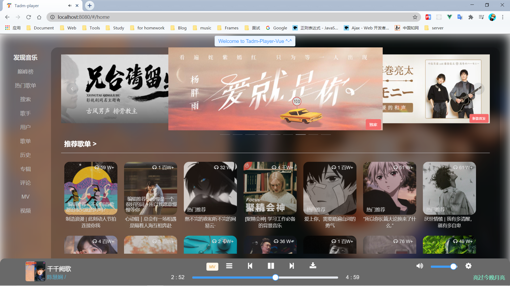
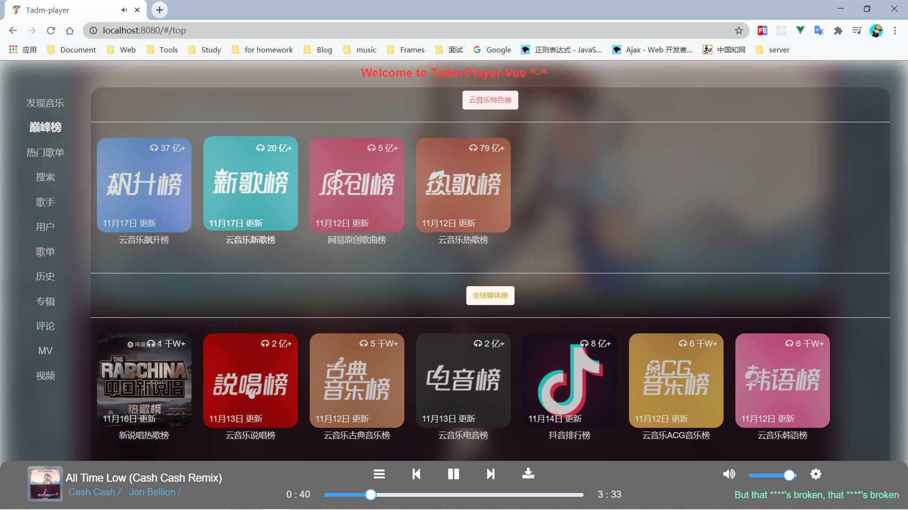
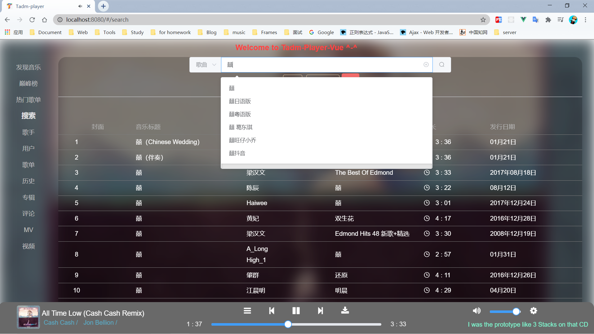
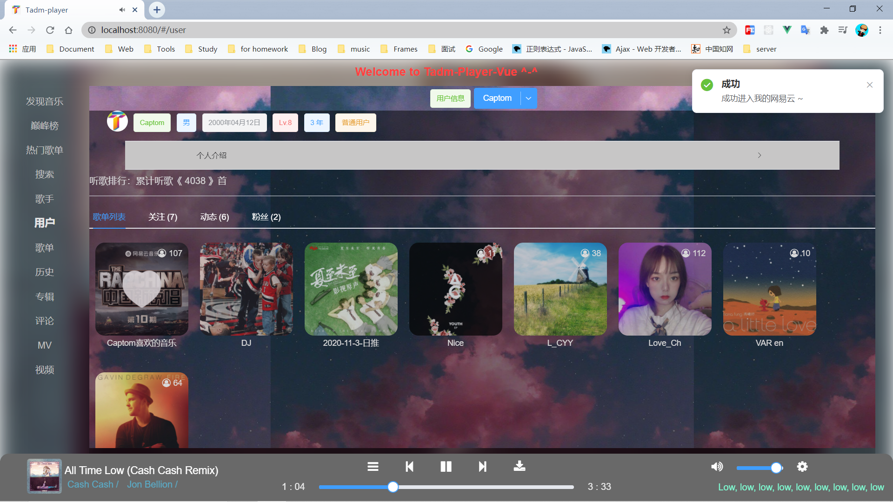
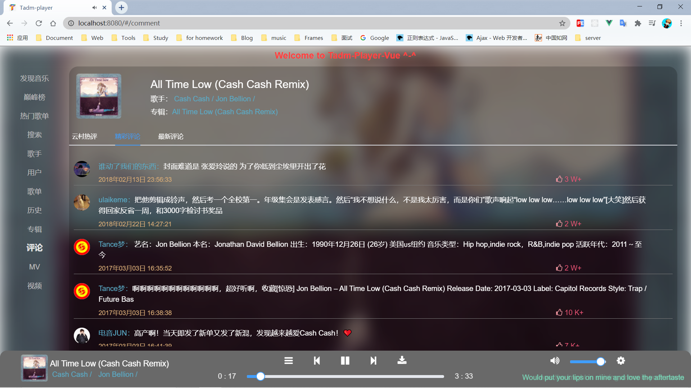

# Tadm-Player-Vue

<div style="display: inline-flex;">


</div>

> 利用 Vue 全家桶实现多源音乐平台，妈妈再也不用担心我听不到喜欢的歌曲啦！

- 前台 --- vue 全家桶
- 后端 --- [NetEaseApi](https://github.com/Binaryify/NeteaseCloudMusicApi)、其他数据源敬请期待~

## Preview

- Github: https://github.com/Liuhongwei3/TadmPlayerVue
- Online Demo: https://tadm.gitee.io/tadmplayer (建议 PC 端体验)

## Usage

```
git clone https://github.com/Liuhongwei3/TadmPlayerVue.git

npm install

npm run serve

npm run build
```

## Announcement

本项目仅供学习使用，不提供任何资源存储，歌曲等数据来自互联网，其版权归资源所属版权方~

## 项目技能树

`Vue` + `Vue-Router` + `Vuex` +`Vue-lazyload` + `ES6` + `Axios` + `Webpack` + `Fontawesome` + `Better-scroll` + `Element-UI` + `async-await` + `NProgress` + `v-viewer` + `...`

## Features

- Play music and remember songs to history
- Visit comments & Enjoy The CloudHotComments
- Enjoy Top Song list & playlists
- Visit your NetEaseCloudMusic Song list & Followers
- Search more songs & Users & details & albums & singers & ...
- Visit Top Singers & enjoy your favorite player's songs & listen them
- watch mvs (all/top/...)
- watch shared/searched videos
- Maybe more ~

## Shortcut

- 首页
  

- 榜单
  

- 搜索
  

- 用户
  

- 评论
  

- More
  > preview online web~

## 项目文件目录树

<details>
  <summary><b>点击查看</b></summary>
<pre><code>
tadm-player-vue
├── babel.config.js
├── dist
│   ├── css
│   │   ├── 1.f9f2f353.css
│   │   ├── 2.89b69a9f.css
│   │   ├── app.974093cc.css
│   │   └── chunk-vendors.f9d003d1.css 
│   ├── favicon.ico
│   ├── fonts
│   │   ├── element-icons.535877f5.woff
│   │   └── element-icons.732389de.ttf 
│   ├── img
│   │   └── 404.aef8654a.jpg
│   ├── index.html
│   └── js
│       ├── 1.6b1e08bc.js
│       ├── 2.85d339e1.js
│       ├── app.79e2667e.js
│       └── chunk-vendors.7feb7771.js
├── package-lock.json
├── package.json
├── public
│   ├── favicon.ico
│   └── index.html
├── README.md
├── src
│   ├── App.vue
│   ├── assets
│   │   ├── 404.jpg
│   │   └── play_icon.png
│   ├── components
│   │   ├── common
│   │   │   ├── backTop
│   │   │   │   └── BackTop.vue
│   │   │   ├── items
│   │   │   │   └── Items.vue
│   │   │   ├── Nav-bar
│   │   │   │   └── NavBar.vue
│   │   │   ├── noResult
│   │   │   │   └── NoResult.vue
│   │   │   └── scroll
│   │   │       ├── HorizontalScroll.vue
│   │   │       └── VerticalScroll.vue
│   │   └── content
│   │       ├── CommContent.vue
│   │       ├── DetailContent.vue
│   │       ├── Drawer.vue
│   │       ├── Event.vue
│   │       ├── EventContent.vue
│   │       ├── LoadMoreFoot.vue
│   │       ├── LogContent.vue
│   │       ├── MvContent.vue
│   │       ├── RLyric.vue
│   │       ├── ShowMv.vue
│   │       ├── ShowVideo.vue
│   │       ├── UserContent.vue
│   │       └── VideoContent.vue
│   ├── css
│   │   ├── App.css
│   │   └── element.css
│   ├── element.js
│   ├── features.js
│   ├── filters.js
│   ├── main.js
│   ├── network
│   │   ├── netease
│   │   │   ├── doReq.js
│   │   │   ├── index.js
│   │   │   └── requests.js
│   │   ├── qq
│   │   │   ├── doReq.js
│   │   │   ├── index.js
│   │   │   └── requests.js
│   │   └── req.js
│   ├── router
│   │   └── index.js
│   ├── store
│   │   ├── actions.js
│   │   ├── index.js
│   │   ├── mutations.js
│   │   └── state.js
│   ├── utils.js
│   └── views
│       ├── About.vue
│       ├── Album.vue
│       ├── Comment.vue
│       ├── Detail.vue
│       ├── History.vue
│       ├── Home.vue
│       ├── HotDetail.vue
│       ├── Mv.vue
│       ├── MyVideo.vue
│       ├── Play.vue
│       ├── Search.vue
│       ├── Singer.vue
│       ├── Top.vue
│       └── User.vue
└── vue.config.js
</code></pre>
</details>

## 细节处理

### Axios 封装

- index.js

```js
import axios from "axios";
import NProgress from "nprogress";

export function request(config) {
  const baseURL =
    process.env.NODE_ENV === "development"
      ? "http://localhost:3000/"
      : "https://api.mtnhao.com/";
  const instance = axios.create({
    baseURL,
    timeout: 10000,
  });

  instance.interceptors.request.use(
    (config) => {
      NProgress.start();
      return config;
    },
    (error) => {
      const { response } = error;
      if (!response) {
        error = { response: { statusText: "网络错误，请检查您的网络连接！" } };
      }
      return Promise.reject(error);
    }
  );

  instance.interceptors.response.use(
    (response) => {
      NProgress.done();
      return response;
    },
    (error) => {
      const { response } = error;
      if (!response) {
        error = { response: { statusText: "网络错误，请检查您的网络连接！" } };
      }
      return Promise.reject(error);
    }
  );

  return instance(config); //  Promise
}
```

- doReq.js

```js
import { request } from "./index";
import { to, notify } from "@/utils";

const doReq = async (url) => {
  // notify("info", "信息提示", "加载数据中！");
  let [err, data] = await to(request({ url }));
  if (err) {
    notify("error", "加载错误", err.response.statusText);
    return false;
  } else {
    return data;
  }
};

export default doReq;
```

- request.js

```js
import { request } from "./index";
import doReq from "./doReq";

// 0: pc
// 1: android
// 2: iphone
// 3: ipad
const getBanner = async (type = 0) => {
  let flag = await doReq(`/banner?type=${type}`);
  if (!flag || !flag.data || !flag.data.banners) {
    return [];
  }

  return flag.data.banners;
};

more...
```

### 歌词部分

- 歌词解析

```js
export function parseLyric(data) {
  let lrc = data.lrc.lyric;
  let tlrc = data.tlyric.lyric;
  let lyrics = lrc.split("\n");
  let tlyrics = tlrc ? tlrc.split("\n") : [];

  let lrcObj = [];
  let lrcMap = new Map();
  let tlrcMap = new Map();
  let lrcTime = new Map();
  let j = 0;
  for (let i = 0; i < lyrics.length; i++) {
    let lyric = decodeURIComponent(lyrics[i]);
    let timeReg = /\[\d*:\d*((\.|\:)\d*)*\]/g;
    let timeRegExpArr = lyric.match(timeReg);
    if (!timeRegExpArr) continue;
    let clause = lyric.replace(timeReg, "");
    for (let k = 0, h = timeRegExpArr.length; k < h; k++) {
      let t = timeRegExpArr[k];
      let min = Number(String(t.match(/\[\d*/i)).slice(1)),
        sec = Number(String(t.match(/\:\d*/i)).slice(1));
      let time = min * 60 + sec;
      if (clause) {
        lrcTime.set(time, j++);
        lrcMap.set(time, clause);
        lrcObj.push({ time: time, text: clause });
      }
    }
  }

  for (let i = 0; i < tlyrics.length; i++) {
    let tlyric = decodeURIComponent(tlyrics[i]);
    let timeReg = /\[\d*:\d*((\.|\:)\d*)*\]/g;
    let timeRegExpArr1 = tlyric.match(timeReg);
    if (!timeRegExpArr1) continue;
    let clause1 = tlyric.replace(timeReg, "");

    for (let k = 0, h = timeRegExpArr1.length; k < h; k++) {
      let t = timeRegExpArr1[k];
      let min = Number(String(t.match(/\[\d*/i)).slice(1)),
        sec = Number(String(t.match(/\:\d*/i)).slice(1));
      let time = min * 60 + sec;
      if (clause1) {
        tlrcMap.set(time, clause1);
      }
    }
  }

  return [lrcObj, lrcMap, tlrcMap, lrcTime];
}
```

- 歌词滚动

```html
<vertical-scroll class="rightL" ref="musicLyric" :probe-type="3">
  <div>
    <div class="lyrics" v-for="(item, index) in lyrics" :key="index">
      <div
        class="lyric"
        :class="{ active: lyricIndex === index || lyrics.length === 1 }"
      >
        {{ item.text }}
      </div>
      <div class="lyric" :class="{ active: lyricIndex === index }">
        {{ item.ttext }}
      </div>
    </div>
  </div>
</vertical-scroll>
```

```js
computed: {
  lyricTop() {
    return `transform :translate3d(0, ${
        -lineH * (this.lyricIndex - this.top)
      }px, 0)`;
  },
},
watch: {
  lyricIndex(newValue) {
    this.lineH = document
      .getElementsByClassName("lyrics")
      [newValue].getBoundingClientRect().height;
    this.calcTop();
    if (newValue > this.top && newValue < this.lyrics.length - this.top) {
      let y = (newValue - this.top) * this.lineH;
      this.$refs.musicLyric.scrollTo(0, -y, 1000);
    }
  },
},
methods:{
  calcTop() {
    let style = document.documentElement.getBoundingClientRect();
    let height = style.width >= 768 ? style.height * 0.5 : style.height * 0.4;

    this.top = Math.floor(height / this.lineH / 2);
  },
}
```

- 当前歌词高亮

```js
audio.addEventListener("timeupdate", () => {
  let curTime = Math.floor(audio.currentTime);

  // 使用 map 代替之前的 for 循环比较，避免不必要的性能消耗
  if (this.lyricsMap.has(curTime)) {
    this.activeLyric = this.lyricsMap.get(curTime);
  }
  if (this.lyricsTime.has(curTime)) {
    this.lyricIndex = this.lyricsTime.get(curTime);
  }
});
```

### 音乐下载

```js
//	PC
export function createDownload(name, player, data) {
  let blob = new Blob([data], { type: "audio/mpeg;charset=utf-8" });
  let downloadElement = document.createElement("a");
  let href = window.URL.createObjectURL(blob);
  downloadElement.href = href;
  downloadElement.download = name + "-" + player + ".mp3";
  document.body.appendChild(downloadElement);
  downloadElement.click();
  document.body.removeChild(downloadElement);
  window.URL.revokeObjectURL(href);
}
```

### Better-scroll

- 公共组件（Vertical）

```html
<template>
  <div ref="wrapper">
    <slot></slot>
  </div>
</template>
```

```js
// https://better-scroll.github.io/docs/zh-CN/
import BScroll from "better-scroll";
import { debounce, throttle } from "@/utils";

export default {
  name: "VerticalScroll",
  data() {
    return {
      scroll: null,
    };
  },
  props: {
    probeType: {
      type: Number,
      default: 3,
    },
    data: {
      type: Array,
      default: () => {
        return [];
      },
    },
    listenScroll: {
      type: Boolean,
      default: false,
    },
    pullUpLoad: {
      type: Boolean,
      default: false,
    },
  },
  mounted() {
    setTimeout(this.__initScroll, 500);
    window.addEventListener("resize", this.refresh);
  },
  methods: {
    __initScroll() {
      // 1.初始化BScroll对象
      if (!this.$refs.wrapper) return;
      this.scroll = new BScroll(this.$refs.wrapper, {
        probeType: this.probeType,
        click: true,
        dblclick: true,
        stopPropagation: true,
        mouseWheel: true,
        pullUpLoad: this.pullUpLoad,
      });

      // 2.将监听事件回调
      this.listenScroll &&
        this.scroll.on(
          "scroll",
          throttle((position) => {
            this.$emit("scroll", position);
          })
        );

      // 3.监听上拉到底部
      this.pullUpLoad &&
        this.scroll.on(
          "pullingUp",
          this.pullUpLoad &&
            debounce(() => {
              this.$emit("pullingUp");
            })
        );
    },
    refresh() {
      //  重新计算 BetterScroll，当 DOM 结构发生变化的时候务必要调用确保滚动的效果正常
      this.scroll && this.scroll.refresh && this.scroll.refresh();
    },
    finishPullUp() {
      // finishPullUp: 这个类似控制一个开关，比如在触发 pullingUp 事件的时候，插件肯定会把一个开关给关掉，防止用户重复上拉
      // 在数据加载完成以后，需要执行 finishPullUp() 把开关打开，以便下次可以继续执行上拉刷新
      this.scroll && this.scroll.finishPullUp && this.scroll.finishPullUp();
    },
    scrollTo(x, y, time) {
      this.scroll && this.scroll.scrollTo && this.scroll.scrollTo(x, y, time);
    },
  },
  beforeDestroy() {
    this.scroll.destroy();
  },
};
```

- Usage

```html
<vertical-scroll
  class="content"
  ref="scroll"
  :probe-type="3"
  :listen-scroll="true"
  :pull-up-load="true"
  @scroll="contentScroll"
  @pullingUp="loadMore"
>
</vertical-scroll>
```

### async-await 统一错误处理

```js
export function to(promise) {
  return promise
    .then((data) => {
      return [null, data];
    })
    .catch((err) => {
      return [err];
    });
}
```

### 懒加载

> 由于本站图片较多，因此使用了**懒加载以及分页**的策略来避免性能消耗过大

### 防抖 & 节流

```js
export function debounce(func, delay = 500, immediate = false) {
  let timer;
  return function(...args) {
    let context = this;
    timer && clearTimeout(timer);
    if (immediate) {
      let callNow = !timer;
      timer = setTimeout(() => (timer = null), delay);
      if (callNow) {
        func.apply(context, args);
      }
    } else {
      timer = setTimeout(() => func.apply(context, ...args), delay);
    }
  };
}

export function throttle(func, delay = 500, immediate = false) {
  let prev = Date.now();
  return function(...args) {
    let now = Date.now(),
      context = this;
    if (now - prev >= delay) {
      func.apply(context, args);
      prev = Date.now();
    }
  };
}
```

### 其他封装

> 详见 `components` 文件夹

## About

> If you like it,Thanks to star and talk more~

## Thanks

> NetEaseCloudMusic & NetEaseMusic & All tools producer ~

Github Repo: https://github.com/Liuhongwei3/TadmPlayerVue

Gitee Repo: https://gitee.com/tadm/TadmPlayer
